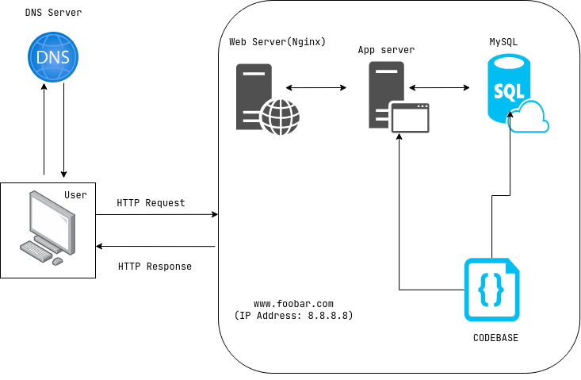

# Simple Web Stack

# Table of Contents

1. [Server](#Whats a Server)
2. [domain name](#What is the role of the domain name)
3. [dns record](#What type of DNS record `www` is in `www.foobar.com`)
4. [role of web server](#What is the role of the web server)

---

# Whats a Server

# What is the role of the domain name

# What type of DNS record `www` is in `www.foobar.com`

# What is the role of the web server

# What is the role of the application server

# What is the role of the database

# What the server is using to communicate with the computer

#
